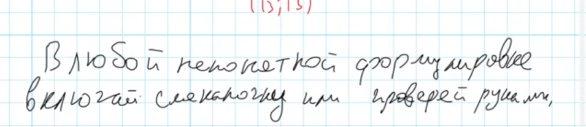

## Функция

*s* - число камней  
*m* - число ходов  
`def win(s, m)`  
*m%2==0* - чей ход, *s>=50* - условие на кол. ходов    
`if s>=50: return m%2==0`  
Если потратили все ходы  
`if m==0: return 0`  
Все ходы, которые мы можем сделать  
`h=[win(s+1, m-1), win(s*2, m-1)]`  
*else all(h)* - проверка на **гарантированную** победу.  
Если на ход игрока есть хотя бы один ход, где он побеждает - возвращаем **True**.  
Если на предыдущий ход все ходы играка возвращают **True**, то возвращаем **True**.  
`return any(h) if (m-1)%2==0 else all(h)`

## Рукурсия наглядно
https://recursion.vercel.app/
### 3 хода

### 4 хода

## Обобщение
Функция отбрвсывает все значения, которые ведут к поражению и остяет те, которые ведут к выйграшу  

## 6.py

